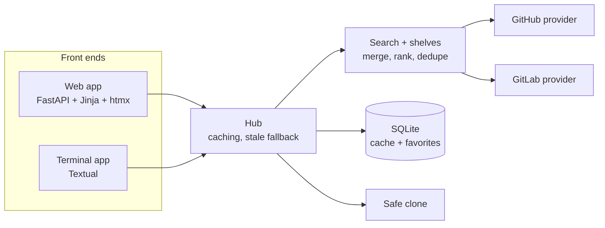

<p align="center">
  
</p>

<p align="center">
  <a href="https://github.com/DaRipper91/repohub/actions/workflows/ci.yml"></a>
  
  
  
  
  
</p>

<p align="center">
  <b>Search GitHub and GitLab in one box. Open a store-style page for any repo. Favorite it. Clone it safely.</b><br>
  <sub>A local web app and a terminal app, sharing one core.</sub>
</p>

<p align="center">
  <a href="#-features">Features</a> ·
  <a href="#-quick-start">Quick start</a> ·
  <a href="#-terminal-app">Terminal app</a> ·
  <a href="#-web-app">Web app</a> ·
  <a href="#-search-syntax">Search syntax</a> ·
  <a href="#-shelves">Shelves</a> ·
  <a href="#-command-line">Command line</a> ·
  <a href="#-how-it-works">How it works</a> ·
  <a href="#-security">Security</a> ·
  <a href="#-development">Development</a> ·
  <a href="#-roadmap">Roadmap</a>
</p>

<p align="center">
  
  <br>
  <sub>The web app's home page: browse shelves, or search both hosts at once. (Captured 2026-09-21 with live data.)</sub>
</p>

---

## ✨ Features

| | |
|---|---|
| 🔎 **One search, two hosts** | GitHub and GitLab are queried together and merged into a single ranked list. Filter by language, minimum stars, recent activity and host; sort by stars, last update or forks; hide forks. A small [search syntax](#-search-syntax) (`lang:rust stars:>500 nofork sort:updated`) works the same in the web app, the terminal app and the CLI. If one host fails or rate-limits you, the other host's results still show. |
| 🗂️ **Store-style shelves** | Browse shelves without typing a query: six search shelves (Terminal tools, Local AI, Retro and emulation, Self-hosted, Creative coding, Networking) and eight curated **Catalog** shelves of 171 hand-picked projects with a note on each. Add your own shelves in a personal YAML file. |
| 💻 **A scriptable CLI** | `repohub search`, `repo`, `shelves`, `shelf` and `favorites` print readable tables or stable JSON, with documented exit codes. Read-only by design. |
| 📄 **Repo pages that read like an app page** | Rendered README, stars, forks, license, topics, and the latest release with its files. A green **arm64** badge appears when a release ships an arm64 or aarch64 build. |
| ⭐ **Favorites** | Save repos to a local wishlist. Stats refresh in the background and never block the page. |
| 📥 **Safe clone** | Shows the exact destination and asks before doing anything. Shallow clone, `https` on `github.com` or `gitlab.com` only, and no install or build steps are ever run. |
| 🖥️ **Two front ends, one core** | A local web app (FastAPI, Jinja, htmx) and a keyboard-driven terminal app (Textual). Both use the same providers, search, cache and favorites. |
| 🔒 **Local-first** | Runs on your machine, binds to loopback by default, keeps tokens in memory, and has no analytics or telemetry. |

## 🚀 Quick start

Requires **Python 3.11 or newer** (developed on 3.12).

```bash
git clone https://github.com/DaRipper91/repohub.git
cd repohub
uv venv --python 3.12 .venv
uv pip install --python .venv/bin/python -e ".[dev]"
```

Prefer plain pip? `python -m venv .venv && .venv/bin/python -m pip install -e ".[dev]"` works too.

Then start whichever front end you like:

```bash
.venv/bin/repohub-web    # http://127.0.0.1:8765   (options: --host, --port)
.venv/bin/repohub-tui    # terminal app            (options: --help, --version)
.venv/bin/repohub        # command line            (repohub --help; see "Command line" below)
```

Add a token for higher API rate limits (optional, see [Tokens](#-tokens-and-configuration)):

```bash
export GITHUB_TOKEN=...   # or just be logged in with the GitHub CLI: gh auth login
export GITLAB_TOKEN=...
```

## 🖥️ Terminal app

Keyboard-first, with everything the web app does. Type a query and press Enter, or open a shelf.

<p align="center">
  
</p>

Curated shelves page 25 entries at a time with `[` and `]`:

<p align="center">
  
  <br>
  <sub>A catalog shelf in the terminal app. Captured 2026-09-21 with live data.</sub>
</p>

Open a repository to read its README and release info. Press `f` to favorite it or `c` to clone it.

<p align="center">
  
</p>

| Key | Action |
|---|---|
| `Enter` | Open the selected shelf or repository |
| `f` | Favorite or unfavorite (repository screen) |
| `c` then `y` / `n` | Clone: shows the destination, then confirm or cancel |
| `[` / `]` | Previous or next page of a curated shelf |
| `Ctrl+F` | Show your favorites |
| `Esc` | Back from a repository, or return to the shelves |
| `Ctrl+Q` | Quit |

## 🌐 Web app

Search across both hosts with filters, then open any repo for a store-style page.

<p align="center">
  
</p>

<p align="center">
  
  <br>
  <sub>A catalog shelf page. Captured 2026-09-21 with live data (as were the screenshots above and below; <code>web-repo.png</code> was refreshed too).</sub>
</p>

<p align="center">
  
</p>

The web app starts on <http://127.0.0.1:8765>. It only accepts requests addressed to `127.0.0.1` or `localhost`; see [Security](#-security).

## 🔎 Search syntax

The search box in the web app, the terminal app and the `repohub search` command all understand the same `key:value` tokens. Keys are case-insensitive; everything that is not a token is searched as plain words.

| Token | Meaning |
|---|---|
| `lang:rust` or `language:rust` | Language |
| `stars:500` or `stars:>500` | Minimum stars (a leading `>` or `>=` is accepted and means "at least") |
| `days:90` | Pushed within the last N days (`days:0` means no limit) |
| `host:github`, `host:gitlab`, `host:both` | Which host to search |
| `sort:stars`, `sort:updated`, `sort:forks` | Ordering |
| `topic:cli` | Topic |
| `nofork` | Hide forks |
| `archived` | Include archived repositories |

```
terminal ui lang:go stars:>500 days:90 sort:updated nofork
```

- `nofork` and `archived` are consumed as flags, so you cannot search for those words themselves.
- An unknown `key:value` (for example `http:x`) stays in the search as ordinary words.
- A token with a bad value is ignored and reported as `Ignored: ...` (a banner in the web app, the status line in the terminal app, stderr on the command line). The rest of the query still runs.
- The web form also has sort and hide-forks controls. A token in the text overrides the matching form control.

## 🗂️ Shelves

A shelf is a named group of repositories on the home page. There are two kinds:

- **Search shelves** run a search (optional `topic`, `language`, `min_stars`, `days`). Six are packaged: Terminal tools, Local AI, Retro and emulation, Self-hosted, Creative coding and Networking.
- **Curated shelves** list exact repositories. Eight packaged `Catalog: ...` shelves hold 171 curated repositories with the curator's one-line note for each, and stats snapshotted on 2026-09-20.

Home-page tiles for curated shelves show the stored snapshots only (no API calls). Opening a shelf refreshes the entries you can see live: 12 per page in the web app, 25 per page in the terminal app (page with `[` and `]`). If refreshing an entry fails, its snapshot is kept. The web app marks such an entry "as of" the snapshot date and the CLI reports `"live": false` for it. The terminal app shows one shelf-level "as of" date in its status line and does not mark individual stale rows. After a host rate-limits a refresh, RepoHub stops refreshing that host's entries for at least 60 seconds (up to an hour, following the host's reset time) and shows their snapshots.

### Your own shelves

Personal shelves go in `shelves.yaml` in your user config directory (`~/.config/repohub/shelves.yaml` on Linux, found with platformdirs' `user_config_dir`). They are loaded after the packaged shelves.

```yaml
- name: My Rust tools            # a search shelf
  topic: cli
  language: Rust
  min_stars: 200
  days: 180

- name: Things I keep meaning to read   # a curated shelf
  as_of: '2026-09-20'
  repos:
    - github:BurntSushi/ripgrep     # a plain string: host:owner/name
    - repo: gitlab:gitlab-org/cli   # or a mapping
      note: Official GitLab CLI.
      snapshot:
        description: GitLab CLI
        stars: 1200
        language: Go
        license: MIT
        pushed_at: '2026-09-01'
```

- Quote dates (`'2026-09-20'`). Unquoted dates in `as_of` and `pushed_at` are accepted and converted, but other fields that should be text must be quoted.
- Limits: the file may be at most 1 MB, with at most 200 shelves and 1000 entries per shelf. Entry numbers in error messages start at 0.
- A broken personal file never stops RepoHub. The problem is shown (a banner in the web app, the status line in the terminal app, a `warning:` line on stderr in the CLI) and the whole personal file is skipped until you fix it. Only regular files are read.

## 💻 Command line

`repohub` is a read-only command for scripts and quick lookups. It never clones, favorites or changes anything.

```
repohub search TEXT... [--lang L] [--min-stars N] [--days N] [--host github|gitlab|both]
                       [--sort stars|updated|forks] [--no-forks] [--archived] [--limit N] [--json]
repohub repo HOST:OWNER/NAME [--readme] [--json]
repohub shelves [--json]
repohub shelf NAME_OR_INDEX [--limit N] [--no-refresh] [--json]
repohub favorites [--json]
```

`search` accepts the [search syntax](#-search-syntax) in its text; tokens in the text override the flags. `--limit` is accepted from 1 to 200 for `search` (default 20), but each host returns at most 30 results per request, so a search shows about 60 rows at most; for `shelf` it is 1 to 50 (default 20). `shelf` takes an exact name (case-insensitive) or the index shown by `repohub shelves`; an argument made only of digits is an index when it is a valid one, otherwise it is matched as a name (with duplicate names the first shelf wins). It shows the first page only. `--no-refresh` makes a curated shelf use its stored snapshots with no API calls. `favorites` and `shelves` do not use the network.

```bash
repohub search "terminal ui lang:go stars:>500 nofork" --limit 10
repohub shelves
repohub shelf "Catalog: Terminal & TUI" --limit 5 --no-refresh
repohub repo github:BurntSushi/ripgrep --json | jq -r '.release.assets[] | select(.arch == "arm64") | .name'
```

**JSON output.** With `--json`, stdout holds exactly one JSON document and everything else (warnings, `Ignored: ...`, notes) goes to stderr. Characters that are dangerous in terminals or logs (control, bidirectional and line-separator characters) are written as `\uXXXX` escapes.

| Command | Document |
|---|---|
| `search`, `favorites` | `{"schema_version": 1, "repos": [...], "errors": {host: message}, "stale": bool}` |
| `shelf` (search shelf) | the same, plus `"shelf": name` |
| `shelf` (curated) | the same, plus `"shelf"`; each repo also has `note`, `as_of` and `live` (`false` when the stored snapshot is shown) |
| `shelves` | `{"schema_version": 1, "shelves": [{"index", "name", "kind", "entries"}]}` (`kind` is `search` or `curated`; `entries` is 0 for search shelves) |
| `repo` | `{"schema_version": 1, "repo": {...}, "release": {"tag", "published_at", "assets": [{"name", "size", "url", "arch"}]} or null, "readme": text or null}` (`readme` only with `--readme`; `arch` is `arm64`, `x86_64` or `unknown`) |

**Exit codes.** `0` success; `1` error (a host failed and there were no results, an unknown shelf or repository, an unexpected error, or a curated shelf refresh that failed for every entry even though snapshot rows were printed); `2` usage error (including a malformed `HOST:OWNER/NAME`); `3` partial success (some results, but a host reported an error, or a curated shelf refreshed only some entries); `130` interrupted. Table output cells are sanitised and truncated to keep lines readable.

## 🧠 How it works



- **Providers** hide the differences between the two APIs, so both front ends only ever see one `Repo` shape.
- **Search** queries both hosts concurrently, merges and ranks by stars, and reports per-host failures instead of failing the whole search.
- **Hub** adds a 10-minute search cache and a 1-hour detail cache in SQLite, and falls back to stale results when a host is unreachable or rate-limited.
- **Favorites and cache** live in a single SQLite file in your user data directory.

<details>
<summary><b>Project layout</b></summary>

```
src/repohub/
  core/
    models.py       Repo, Release, Asset, SearchFilters
    providers/      github.py, gitlab.py, base.py (errors, slug + URL validation)
    search.py       fan-out, merge, rank, dedupe
    queryparse.py   search syntax (key:value tokens)
    browse.py       packaged and personal shelves (search and curated)
    hub.py          facade used by both front ends: caching, stale fallback
    cache.py        SQLite response cache with TTL
    store.py        favorites
    clone.py        safe git clone
    auth.py         token discovery
    textsafe.py     control-character stripping for untrusted text
  web/              FastAPI app, templates, static files (htmx is vendored)
  tui/              Textual app
  cli.py            the read-only repohub command
  config.py         wires providers, cache and favorites together
docs/plans/         design and implementation plan
tests/              offline test suite (+ opt-in live tests)
```

</details>

## 🔑 Tokens and configuration

Tokens are optional but raise API rate limits. Without one, GitHub search allows only about 10 requests a minute; RepoHub then shows a per-host banner and serves cached results where it can.

| What | How |
|---|---|
| GitHub token | `GITHUB_TOKEN`, then `GH_TOKEN`, then the output of `gh auth token` if the GitHub CLI is installed |
| GitLab token | `GITLAB_TOKEN` |
| Clone folder | `REPOHUB_CLONE_DIR` (default `~/playground`) |
| Shelves | Packaged shelves ship with the app; add your own in `~/.config/repohub/shelves.yaml` (see [Shelves](#-shelves)) |
| Cache and favorites | One SQLite file, `repohub.db`, in your user data directory (`~/.local/share/repohub/` on Linux) |

Tokens are held in memory only, sent only to their own API host, and never logged. Surrounding whitespace is stripped. If a token is rejected (HTTP 401), RepoHub drops it for that host and retries once anonymously.

## 🛡️ Security

RepoHub renders untrusted data (descriptions, READMEs, release names) and runs `git clone`, so it is built defensively. Full details are in [SECURITY.md](SECURITY.md); report problems privately through GitHub's *Report a vulnerability*.

<details>
<summary><b>What protects what</b></summary>

**Web app**
- Binds to `127.0.0.1` by default and only accepts the `Host` headers `127.0.0.1` and `localhost`. A non-loopback `--host` prints a warning, and the Host allow-list still refuses other names.
- Favorite and clone requests need a per-session token, regenerated on every launch (a tab left open across a restart shows an error until reloaded).
- READMEs are rendered with markdown-it (raw HTML off, links validated) and then sanitised with nh3. A Content-Security-Policy limits scripts and other resources to the app itself.
- Links and homepages from API data are only shown when they are `http` or `https`.

**Terminal app**
- Renders all untrusted text as plain text (no markup interpretation) and opens links only when they are `http` or `https`.

**Data**
- Control characters and bidirectional-override characters are stripped from provider data at the boundary; README text is capped at 200,000 characters.

**Clone**
- Only `https` URLs on `github.com` or `gitlab.com`; strict validation, then the URL is rebuilt in canonical form.
- Shallow (`--depth 1`); no install or build steps are run.
- Git runs with a locked-down environment: no prompts, https-only protocol, no system or global git config (`GIT_CONFIG_GLOBAL=/dev/null`, so proxy or credential-helper setups must be passed through environment variables).
- The destination must sit directly inside the chosen folder, an existing folder is never overwritten, concurrent clones of the same target are refused, and a failed clone cleans up only what it created.

</details>

## 🧪 Development

```bash
.venv/bin/pytest            # offline suite (live tests are deselected)
.venv/bin/pytest -m live    # opt-in smoke tests against the real GitHub and GitLab APIs
```

The offline suite uses mocked HTTP and fake providers, so it needs no network, no tokens and no real `git`. The live tests use a token found as described above, or run anonymously and may hit rate limits. CI runs the offline suite on Python 3.11 and 3.12.

The design and the task-by-task implementation plans are in [`docs/plans/`](docs/plans/).

## 🗺️ Roadmap

RepoHub grows in phases. Each phase gets a written design, a task-by-task plan, a fresh implementer for every task, and an independent review (with a security pass for anything that touches untrusted data, URLs, files or processes) before the next task starts. The current roadmap and its rationale are in [`docs/plans/2026-09-21-hosts-accounts-design.md`](docs/plans/2026-09-21-hosts-accounts-design.md) (which renumbers the earlier list in [`docs/plans/2026-09-21-phase1-design.md`](docs/plans/2026-09-21-phase1-design.md)).

| Phase | What it adds | Status |
|---|---|---|
| **v1** | Cross-host search, shelves, repo pages, favorites, safe clone, web app and terminal app | ✅ Done (13 tasks) |
| **1. Foundations** | Filters and sorting everywhere, curated shelves and the 171-project catalog, the scriptable CLI (v0.2.0) | ✅ Done (13 tasks) |
| **2. Other hosts** | A host registry and a Forgejo/Gitea provider: Codeberg built in, plus any Forgejo or Gitea instance you add in a config file | 🔨 Next |
| **3. Accounts and login** | Uses the sign-ins you already have (env variables, `gh` CLI) and stores nothing; an Accounts page shows who you are on each host, where the token came from, its scopes and rate limit | 📝 Planned |
| **4. Star and fork** | Star, unstar and fork from the web and terminal apps, always confirmed, with a local action log. The CLI stays read-only | 📝 Planned |
| **5. Recommendations** | Suggestions from your favorites, your stars, an opt-in local history, and "similar to this repo", all computed on your machine | 📝 Planned |
| **6. Machine awareness** | "Already cloned" badges, a "Can I run this here?" panel (arm64 release assets, installed toolchains), and a shared project detector | ⏸️ Paused |
| **7. Guided install and run** | Shows the exact install and run commands for a cloned repo; you approve each command before it runs, and output streams live | 📝 Planned |
| **8. Favorites 2.0** | Tags, notes and collections for favorites, and a "new releases" tab | 📝 Planned |
| **9. Claude Code** | An MCP server (read-only by default), "Open in Claude Code" after cloning, and a `/repohub` skill built on the CLI | 📝 Planned |
| **10. UI redesign** | A better-looking web app and terminal app, done once the features above exist | 📝 Planned |

Standing rules for every phase: the existing clone protections stay as they are; running a repository's own code (Phase 7) is always a separate, explicit, opt-in action that shows exactly what it will run; and actions that change your accounts (Phase 4) are always confirmed and never run from the CLI.

<details>
<summary><b>Tasks: v1 (all done)</b></summary>

1. ✅ Project scaffold
2. ✅ Models and architecture parsing
3. ✅ Token discovery
4. ✅ SQLite cache with TTL
5. ✅ GitHub provider
6. ✅ GitLab provider
7. ✅ Cross-host search
8. ✅ Favorites store
9. ✅ Safe clone
10. ✅ Shelves and the Hub facade
11. ✅ Web app
12. ✅ Terminal app
13. ✅ README, live smoke tests and final verification

</details>

<details>
<summary><b>Tasks: Phase 1, Foundations (all done)</b></summary>

1. ✅ Model fields: `fork`, `sort`, `hide_forks`
2. ✅ Provider support for sorting and fork data
3. ✅ Merge, hide forks and final sort
4. ✅ Shared query-syntax parser
5. ✅ Web filters, sorting and query syntax
6. ✅ Terminal app query syntax
7. ✅ Shelf model, loader and personal shelves file
8. ✅ Hub support for curated shelves
9. ✅ Catalog shelves (171 projects)
10. ✅ Web curated shelves and shelf pages
11. ✅ Terminal curated shelves with paging
12. ✅ The `repohub` CLI
13. ✅ Docs, version bump and final verification

</details>

<details>
<summary><b>Sketch of the next phases</b> (each phase's real task list is written in its own plan)</summary>

- **Phase 2, other hosts:** a host registry replacing the hard-coded GitHub and GitLab pair; a Forgejo/Gitea provider (search, README, releases); Codeberg built in; extra instances in `~/.config/repohub/hosts.yaml` with strict URL validation; search, shelves, favorites, the CLI and the clone allow-list all reading the registry.
- **Phase 3, accounts and login:** token discovery per host; identity, scope and rate-limit lookups; an Accounts page in the web app, a key in the terminal app and a read-only `repohub accounts` command; nothing stored on disk.
- **Phase 4, star and fork:** star, unstar and fork for GitHub, GitLab and Forgejo; a confirmation naming the host, repository and account; no automatic retries; a local action log.
- **Phase 5, recommendations:** an interest profile from favorites, stars and an opt-in history; a "Recommended for you" shelf, "Similar repositories" on repo pages, and read-only `repohub recommend` and `repohub similar` commands; every suggestion explains why.
- **Phase 6, machine awareness:** a project detector (Cargo.toml, pyproject or requirements, package.json, Makefile, Dockerfile); a toolchain check; a "can I run this here?" panel; "already cloned" badges from a scan of your clone folder only.
- **Phase 7, guided install and run:** proposing commands from the detector; an approval step for every command; a runner confined to the cloned folder that streams output; strict review because it runs the repository's own code.
- **Phase 8, favorites 2.0:** storage for tags, notes and collections; editing and filtering in every interface; a "new releases" view.
- **Phase 9, Claude Code:** a read-only MCP server; an "Open in Claude Code" action after cloning; a `/repohub` skill on top of the CLI; cloning or installing through Claude Code stays a separate, individually approved action.
- **Phase 10, UI redesign:** a design pass over the web and terminal apps, with fresh screenshots.

</details>

## ⚠️ Known limitations

- Results from the two hosts are deduplicated by `owner/name`, so different repositories that share an owner and name across hosts are merged.
- GitLab search results carry no language unless you filter by language, and its minimum-stars filter is applied client-side, so a page of results can shrink.
- Recency filters drop repositories with an unknown push date.
- Curated shelf refreshes use extra API requests (a bounded number per page, cached for one hour). Without a token GitHub allows only about 60 core requests per hour, so keep a token set for heavy browsing.
- GitHub's own "updated" ordering differs slightly from the last-push date RepoHub re-sorts by, so `sort:updated` can reorder the fetched page.
- A rate-limited host stops curated refreshes for a while (at least 60 seconds) and shows the snapshot instead.
- Personal search shelves are validated: `language` and `topic` must use the same characters the search syntax allows (`topic` is lowercased), `query` is at most 200 characters on one line, and a `repos` key that is empty is an error.
- GitLab cannot sort by forks or hide forks server-side, so those options only apply to the results that were fetched.
- Remote images in READMEs can load in the web app (the CSP allows `img-src *`), which shows your IP address to those hosts.
- The cache is never purged; expired entries are only overwritten.
- Not included yet: other hosts (Codeberg and other Forgejo or Gitea servers are Phase 2; Bitbucket is not planned), accounts and login, starring or forking from inside the app, and recommendations. See the [roadmap](#-roadmap) for what is planned.

## 📜 License

[MIT](LICENSE) © 2026 DaRipper91
