<p align="center">
  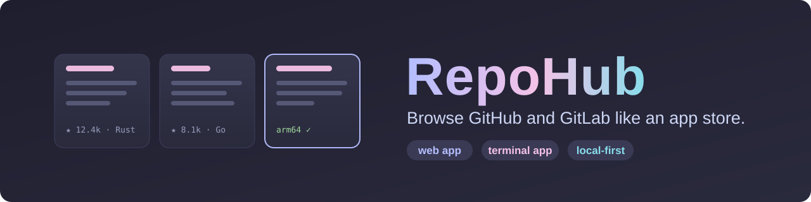
</p>

<p align="center">
  <a href="https://github.com/DaRipper91/repohub/actions/workflows/ci.yml"></a>
  
  
  
  
  
</p>

<p align="center">
  <b>Search GitHub, GitLab and Codeberg in one box. Open a store-style page for any repo. Favorite it. Clone it safely.</b><br>
  <sub>A local web app and a terminal app, sharing one core.</sub>
</p>

<p align="center">
  <a href="#-features">Features</a> ·
  <a href="#-quick-start">Quick start</a> ·
  <a href="#-terminal-app">Terminal app</a> ·
  <a href="#-web-app">Web app</a> ·
  <a href="#-hosts">Hosts</a> ·
  <a href="#-search-syntax">Search syntax</a> ·
  <a href="#-shelves">Shelves</a> ·
  <a href="#-command-line">Command line</a> ·
  <a href="#-how-it-works">How it works</a> ·
  <a href="#-security">Security</a> ·
  <a href="#-development">Development</a> ·
  <a href="#-roadmap">Roadmap</a>
</p>

<p align="center">
  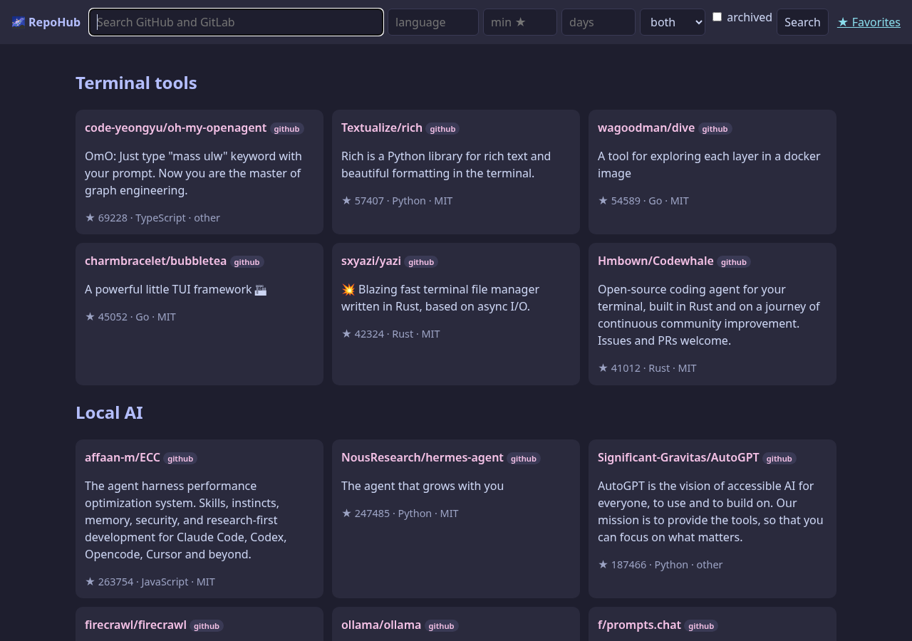
  <br>
  <sub>The web app's home page: browse shelves, or search every host at once. (Captured 2026-09-21 with live data.)</sub>
</p>

---

## ✨ Features

| | |
|---|---|
| 🔎 **One search, every host** | GitHub, GitLab and Codeberg are queried together and merged into a single ranked list. Codeberg is built in, and a `hosts.yaml` file adds more Forgejo or Gitea servers (see [Hosts](#-hosts)). Filter by language, minimum stars, recent activity and host; sort by stars, last update or forks; hide forks. A small [search syntax](#-search-syntax) (`lang:rust stars:>500 nofork sort:updated`) works the same in the web app, the terminal app and the CLI. If one host fails or rate-limits you, the other hosts' results still show. |
| 🗂️ **Store-style shelves** | Browse shelves without typing a query: six search shelves (Terminal tools, Local AI, Retro and emulation, Self-hosted, Creative coding, Networking) and nine curated **Catalog** shelves of hand-picked projects with a note on each (171 across eight general shelves, plus 18 on Codeberg). Add your own shelves in a personal YAML file. |
| 💻 **A scriptable CLI** | `repohub search`, `repo`, `shelves`, `shelf`, `favorites`, `hosts` and `accounts` print readable tables or stable JSON, with documented exit codes. Read-only by design. |
| 📄 **Repo pages that read like an app page** | Rendered README, stars, forks, license, topics, and the latest release with its files. A green **arm64** badge appears when a release ships an arm64 or aarch64 build. |
| ⭐ **Favorites** | Save repos to a local wishlist. Stats refresh in the background and never block the page. |
| 📥 **Safe clone** | Shows the exact destination and asks before doing anything. Shallow clone, `https` on a configured host only (`github.com`, `gitlab.com`, `codeberg.org` and any host in your `hosts.yaml`), and no install or build steps are ever run. |
| 🖥️ **Two front ends, one core** | A local web app (FastAPI, Jinja, htmx) and a keyboard-driven terminal app (Textual). Both use the same providers, search, cache and favorites. |
| 🔒 **Local-first** | Runs on your machine, binds to loopback by default, keeps tokens in memory, and has no analytics or telemetry. |

## 🚀 Quick start

Requires **Python 3.11 or newer** (developed on 3.12).

```bash
git clone https://github.com/DaRipper91/repohub.git
cd repohub
uv venv --python 3.12 .venv
uv pip install --python .venv/bin/python -e ".[dev]"
```

Prefer plain pip? `python -m venv .venv && .venv/bin/python -m pip install -e ".[dev]"` works too.

Then start whichever front end you like:

```bash
.venv/bin/repohub-web    # http://127.0.0.1:8765   (options: --host, --port)
.venv/bin/repohub-tui    # terminal app            (options: --help, --version)
.venv/bin/repohub        # command line            (repohub --help; see "Command line" below)
```

Add a token for higher API rate limits (optional, see [Tokens](#-tokens-and-configuration)):

```bash
export GITHUB_TOKEN=...   # or just be logged in with the GitHub CLI: gh auth login
export GITLAB_TOKEN=...
```

## 🖥️ Terminal app

Keyboard-first, with everything the web app does. Type a query and press Enter, or open a shelf.

<p align="center">
  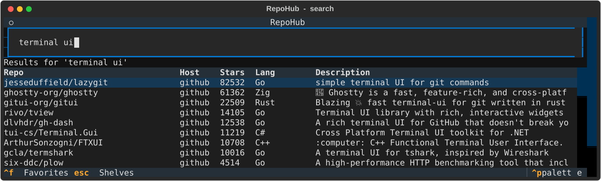
</p>

Curated shelves page 25 entries at a time with `[` and `]`:

<p align="center">
  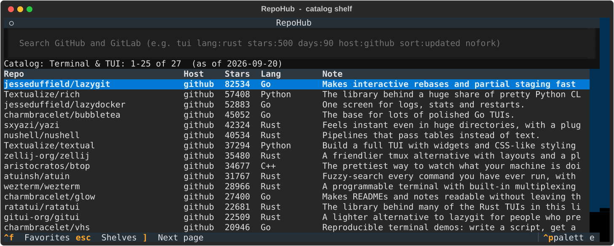
  <br>
  <sub>A catalog shelf in the terminal app. Captured 2026-09-21 with live data.</sub>
</p>

Open a repository to read its README and release info. Press `f` to favorite it or `c` to clone it.

<p align="center">
  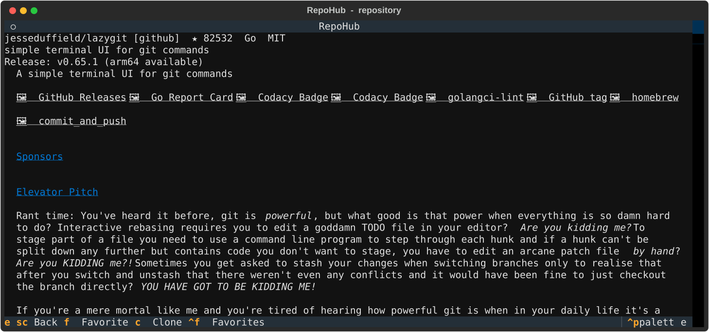
</p>

| Key | Action |
|---|---|
| `Enter` | Open the selected shelf or repository |
| `f` | Favorite or unfavorite (repository screen) |
| `c` then `y` / `n` | Clone: shows the destination, then confirm or cancel |
| `[` / `]` | Previous or next page of a curated shelf |
| `Ctrl+F` | Show your favorites |
| `F2` | Show your accounts: who you are signed in as on each host, plus recent star and fork actions |
| `F3` / `F4` | Turn your local history on or off / clear it (asks first) |

The last row of the shelf list, **Recommended for you**, shows suggestions with the reason for each.

On a repository's screen: `s` stars or unstars it and `k` forks it. Each asks `y`/`n` first, naming the host, repository and account, and makes one attempt (never retried). You must be signed in on that host (see the Accounts page).
| `d` | Remove the selected favorite (favorites view; works for hosts that are no longer configured) |
| `Esc` | Back from a repository, or return to the shelves |
| `Ctrl+Q` | Quit |

## 🌐 Web app

Search across all hosts with filters, then open any repo for a store-style page.

<p align="center">
  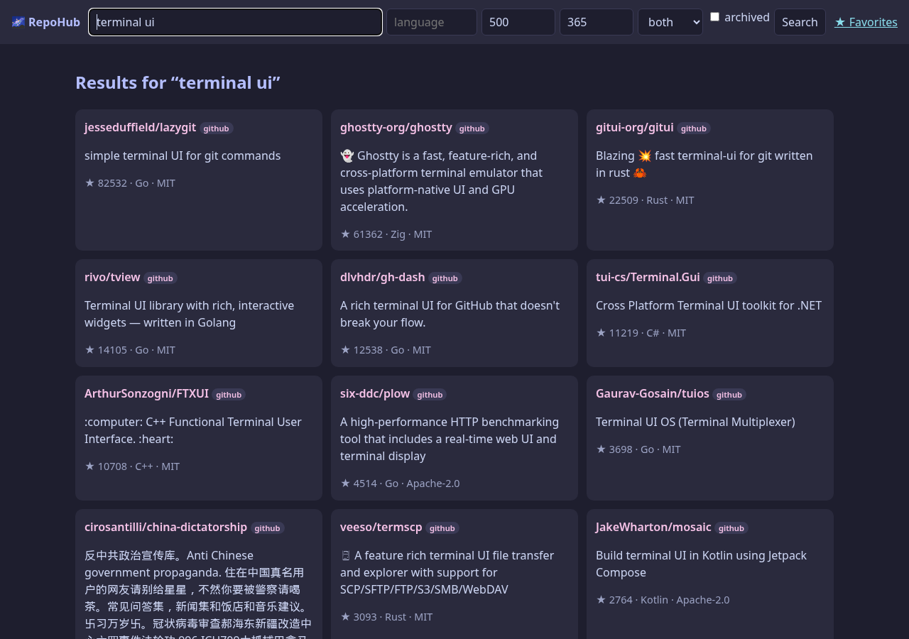
  <br>
  <sub>One search across every host: GitHub results and Codeberg's <code>dnkl/foot</code> (blue badge) ranked together. Captured 2026-09-21 with live data.</sub>
</p>

<p align="center">
  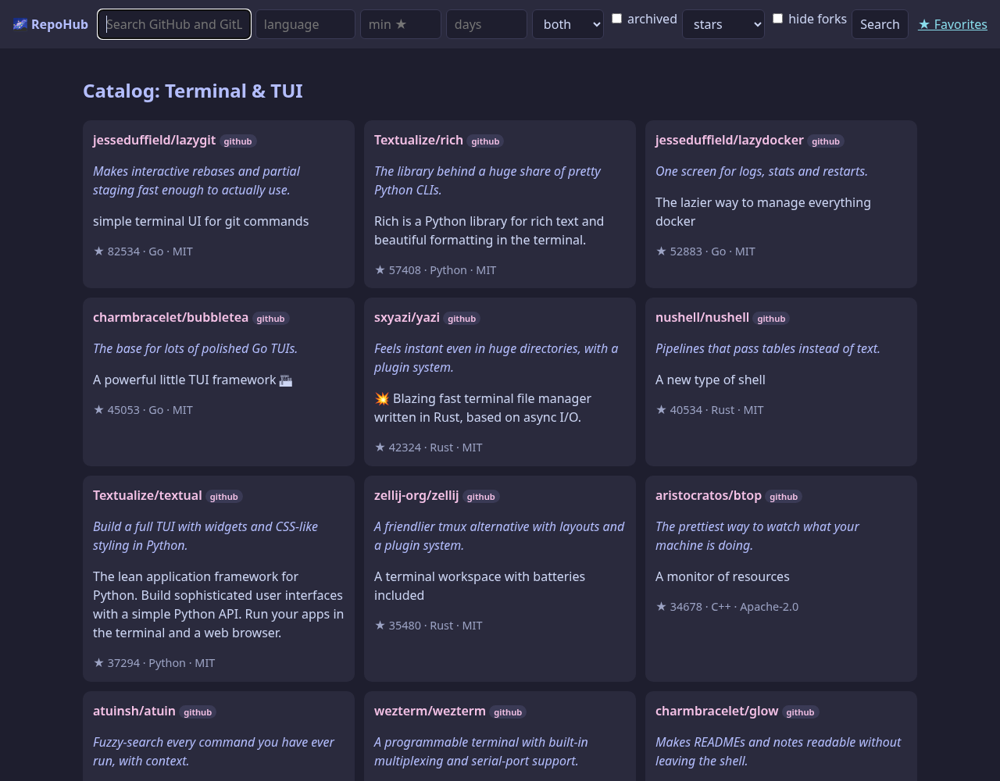
  <br>
  <sub>A catalog shelf page. Captured 2026-09-21 with live data (as were the screenshots above and below; <code>web-repo.png</code> was refreshed too).</sub>
</p>

<p align="center">
  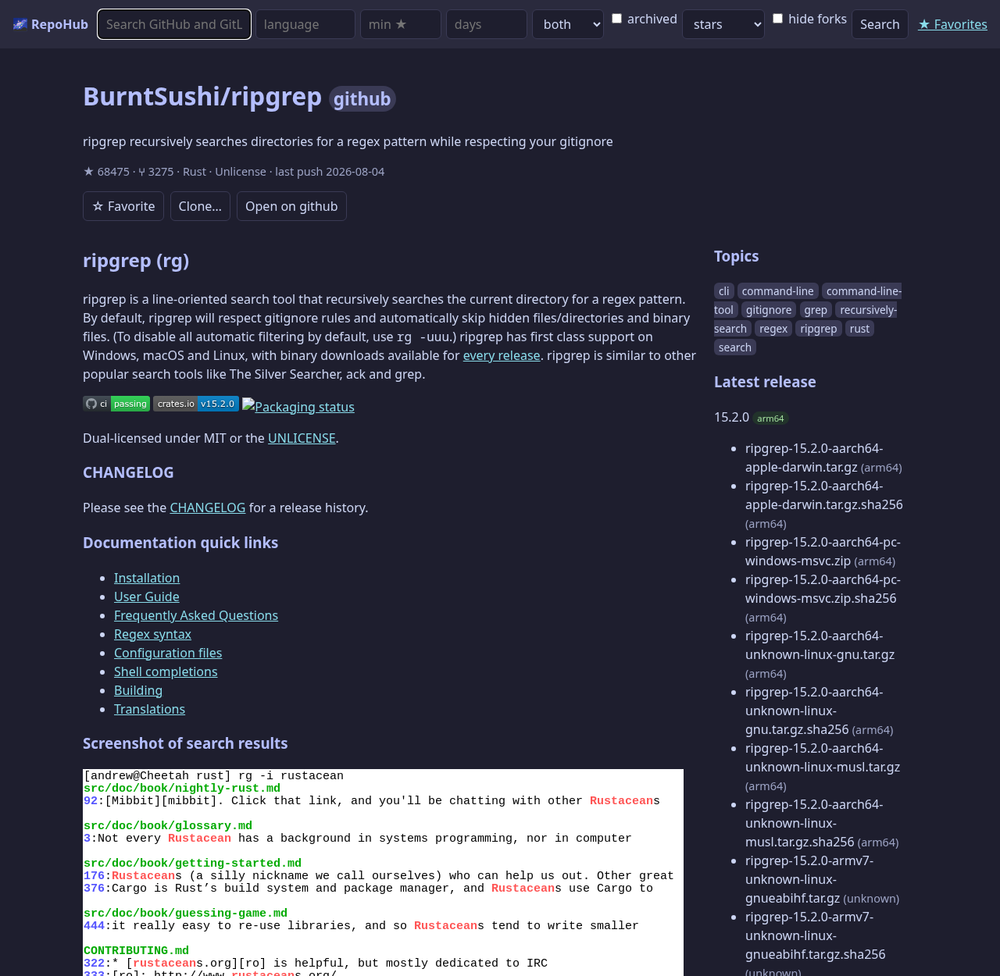
</p>

The web app starts on <http://127.0.0.1:8765>. It only accepts requests addressed to `127.0.0.1` or `localhost`; see [Security](#-security).

## 🌍 Hosts

RepoHub searches every configured host at once. Three are built in:

| Id | Host | Kind |
|---|---|---|
| `github` | GitHub (`github.com`) | GitHub |
| `gitlab` | GitLab (`gitlab.com`) | GitLab |
| `codeberg` | Codeberg (`codeberg.org`) | Forgejo |

<p align="center">
  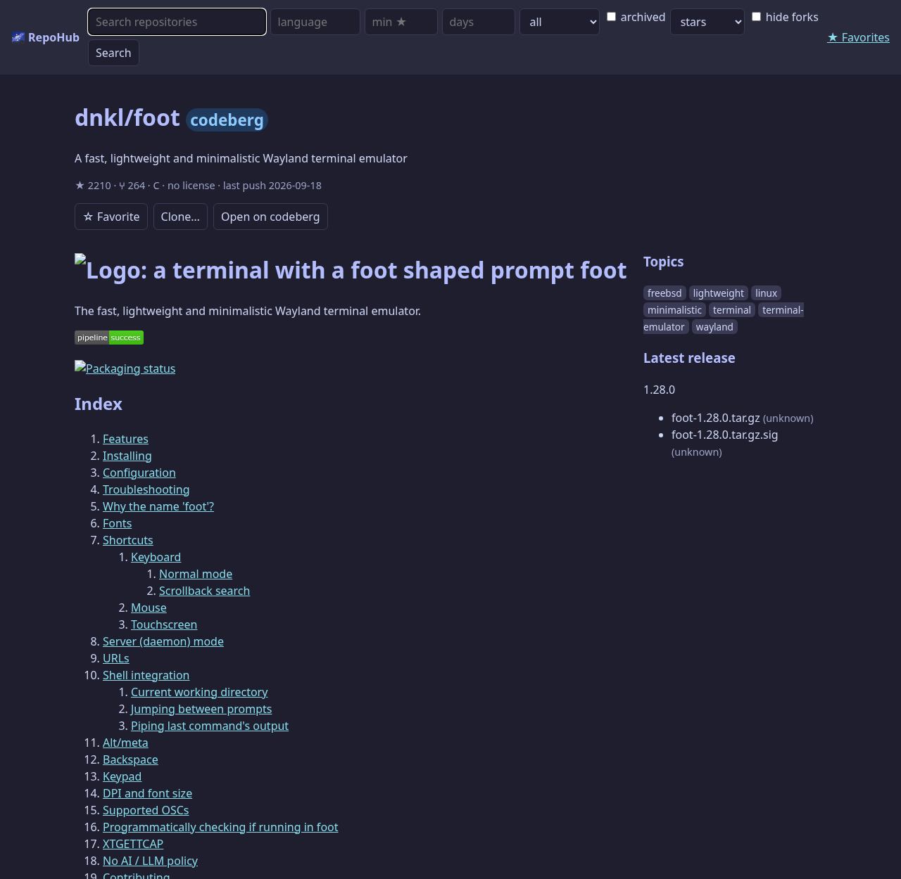
  <br>
  <sub>A Codeberg repository page: README, topics and the latest release. Captured 2026-09-21 with live data. (Forgejo does not expose a license, so it shows as "no license".)</sub>
</p>

### More Forgejo and Gitea servers

Add your own servers in `hosts.yaml` in your user config directory (`~/.config/repohub/hosts.yaml` on Linux, next to `shelves.yaml`):

```yaml
- {id: myforge, kind: forgejo, url: https://git.example.org, token_env: REPOHUB_MYFORGE_TOKEN}
```

`name` is optional (it defaults to the id). The rules, in plain words:

- Only `kind: forgejo` is supported (Gitea servers speak the same API).
- `url` must be `https` with a plain hostname: no credentials, port, path, query or fragment. IP addresses and `localhost` are rejected, and the instance must serve its API at `/api/v1` on the standard https port.
- `id` uses lowercase letters, digits and `-`, starts with a letter, is at most 20 characters, and cannot reuse a built-in id (`github`, `gitlab`, `codeberg`). `all` and `both` are reserved (they mean every host in `host:` searches).
- Domains and token variables must be unique across all hosts.
- `token_env` must start with `REPOHUB_` and end in `_TOKEN` (capital letters, digits and `_`). It defaults to `REPOHUB_<ID>_TOKEN`. This is deliberate: a config file cannot point an unrelated variable such as `AWS_SESSION_TOKEN` at a host.
- At most 20 extra hosts. The file may be at most 256 KB, must be a regular file, and duplicate YAML keys are rejected.
- A broken entry is skipped with a message. A broken file is skipped as a whole. The built-in hosts always load.

Problems are shown as a banner on the web home page, in the status line of the terminal app, and as `warning:` lines on stderr from every `repohub` command. Check your setup offline with `repohub hosts`.

### Tokens per host

| Host | Token |
|---|---|
| GitHub | `GITHUB_TOKEN`, then `GH_TOKEN`, then `gh auth token` |
| GitLab | `GITLAB_TOKEN` |
| Codeberg | `CODEBERG_TOKEN` |
| Extra host | its `token_env` (default `REPOHUB_<ID>_TOKEN`) |

A token is only ever sent to its own host.

### What a Forgejo host shows

- The license is shown as unknown, because the server does not expose it.
- The server's search matches a single keyword. With several words, RepoHub sends the longest word and requires all words to match (in the name, description or topics) on your side.
- Language, minimum stars and recency are filtered client-side, so a page of results can shrink.
- Clone is allowed only from configured hosts.

### Trust model

An extra host is a server you chose. What it reports (names, star counts, URLs, descriptions) is shown as it says, after control characters are stripped. Some limits still apply:

- It can never override a built-in host's entry on a duplicate `owner/name`: a built-in host's result always wins over an extra host's, whatever the star counts.
- A repository's page link (`html_url`) is only used when it is on the host's own domain; otherwise RepoHub builds the link from the host's domain. Release download links may point elsewhere (for example a CDN) but must be plain `http` or `https` URLs without credentials.
- The rejection of IP addresses and `localhost` in `hosts.yaml` is a simple safeguard against typing a local address. It does not stop a DNS name that resolves to a private address, so only add servers you trust.
- Each host call has a 20-second deadline, and responses from Forgejo hosts are read up to 4 MB and at most one page of results is used. A host that is slow, fails or sends too much shows an error banner while the other hosts' results still appear. When a search is only partly successful, that partial result is cached for 60 seconds so a failing host does not cause repeated requests to the healthy ones.

## 🔎 Search syntax

The search box in the web app, the terminal app and the `repohub search` command all understand the same `key:value` tokens. Keys are case-insensitive; everything that is not a token is searched as plain words.

| Token | Meaning |
|---|---|
| `lang:rust` or `language:rust` | Language |
| `stars:500` or `stars:>500` | Minimum stars (a leading `>` or `>=` is accepted and means "at least") |
| `days:90` | Pushed within the last N days (`days:0` means no limit) |
| `host:github`, `host:gitlab`, `host:codeberg`, `host:all` (or `host:both`) | Which host to search: any configured host id (see [Hosts](#-hosts)), or all of them. `both` is an alias for `all` |
| `sort:stars`, `sort:updated`, `sort:forks` | Ordering |
| `topic:cli` | Topic |
| `nofork` | Hide forks |
| `archived` | Include archived repositories |

```
terminal ui lang:go stars:>500 days:90 sort:updated nofork
```

- `nofork` and `archived` are consumed as flags, so you cannot search for those words themselves.
- An unknown `host:` value is reported as `Ignored: ...` and lists the configured ids.
- An unknown `key:value` (for example `http:x`) stays in the search as ordinary words.
- A token with a bad value is ignored and reported as `Ignored: ...` (a banner in the web app, the status line in the terminal app, stderr on the command line). The rest of the query still runs.
- The web form also has sort and hide-forks controls. A token in the text overrides the matching form control.

## 🗂️ Shelves

A shelf is a named group of repositories on the home page. There are two kinds:

- **Search shelves** run a search (optional `topic`, `language`, `min_stars`, `days`). Six are packaged: Terminal tools, Local AI, Retro and emulation, Self-hosted, Creative coding and Networking.
- **Curated shelves** list exact repositories. Nine packaged `Catalog: ...` shelves hold curated repositories with the curator's one-line note for each: eight general shelves with 171 repositories (stats snapshotted on 2026-09-20), and `Catalog: Codeberg` with 18 repositories on Codeberg.

Home-page tiles for curated shelves show the stored snapshots only (no API calls). Opening a shelf refreshes the entries you can see live: 12 per page in the web app, 25 per page in the terminal app (page with `[` and `]`). If refreshing an entry fails, its snapshot is kept. The web app marks such an entry "as of" the snapshot date and the CLI reports `"live": false` for it. The terminal app shows one shelf-level "as of" date in its status line and does not mark individual stale rows. After a host rate-limits a refresh, RepoHub stops refreshing that host's entries for at least 60 seconds (up to an hour, following the host's reset time) and shows their snapshots.

<p align="center">
  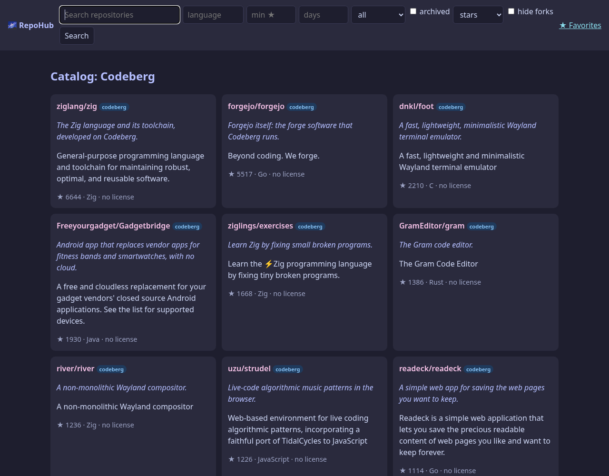
  <br>
  <sub>The <code>Catalog: Codeberg</code> shelf: 18 Codeberg projects with the curator's notes and live stats. Captured 2026-09-21 with live data.</sub>
</p>

### Your own shelves

Personal shelves go in `shelves.yaml` in your user config directory (`~/.config/repohub/shelves.yaml` on Linux, found with platformdirs' `user_config_dir`). They are loaded after the packaged shelves.

```yaml
- name: My Rust tools            # a search shelf
  topic: cli
  language: Rust
  min_stars: 200
  days: 180

- name: Things I keep meaning to read   # a curated shelf
  as_of: '2026-09-20'
  repos:
    - github:BurntSushi/ripgrep     # a plain string: host:owner/name (any configured host id)
    - repo: gitlab:gitlab-org/cli   # or a mapping
      note: Official GitLab CLI.
      snapshot:
        description: GitLab CLI
        stars: 1200
        language: Go
        license: MIT
        pushed_at: '2026-09-01'
```

- Favorites and shelf entries for a host that is no longer configured stay stored. A favorite shows as unavailable (`host not configured`) and can be removed: the web favorites page has a Remove button, and the terminal app's favorites view has the `d` key. A shelf entry for such a host stays stored. Opening the shelf shows its snapshot with `host not configured` instead of calling anything.
- Quote dates (`'2026-09-20'`). Unquoted dates in `as_of` and `pushed_at` are accepted and converted, but other fields that should be text must be quoted.
- Limits: the file may be at most 1 MB, with at most 200 shelves and 1000 entries per shelf. Entry numbers in error messages start at 0.
- A broken personal file never stops RepoHub. The problem is shown (a banner in the web app, the status line in the terminal app, a `warning:` line on stderr in the CLI) and the whole personal file is skipped until you fix it. Only regular files are read.

## 💻 Command line

`repohub` is a read-only command for scripts and quick lookups. It never clones, favorites or changes anything.

```
repohub search TEXT... [--lang L] [--min-stars N] [--days N] [--host ID|all]
                       [--sort stars|updated|forks] [--no-forks] [--archived] [--limit N] [--json]
repohub repo HOST:OWNER/NAME [--readme] [--json]
repohub hosts [--json]
repohub accounts [--json]
repohub cloned [--json]
repohub roots [--scan] [--system] [--json]
repohub check HOST:OWNER/NAME [--json]
repohub recommend [--limit N] [--json]
repohub similar HOST:OWNER/NAME [--limit N] [--json]
repohub shelves [--json]
repohub shelf NAME_OR_INDEX [--limit N] [--no-refresh] [--json]
repohub favorites [--json]
```

`search` accepts the [search syntax](#-search-syntax) in its text; tokens in the text override the flags. `--limit` is accepted from 1 to 200 for `search` (default 20), but each host returns at most 30 results per request, so a search shows about 30 rows per host at most; for `shelf` it is 1 to 50 (default 20). `shelf` takes an exact name (case-insensitive) or the index shown by `repohub shelves`; an argument made only of digits is an index when it is a valid one, otherwise it is matched as a name (with duplicate names the first shelf wins). It shows the first page only. `--no-refresh` makes a curated shelf use its stored snapshots with no API calls. `--host` takes `all` (or `both`) or any configured host id; it is checked after the arguments are parsed, and an unknown id is a usage error. `repo` accepts `HOST:OWNER/NAME` for any configured host. `favorites`, `shelves` and `hosts` do not use the network.

```bash
repohub search "terminal ui lang:go stars:>500 nofork" --limit 10
repohub hosts
repohub search "terminal ui host:codeberg" --limit 10
repohub shelves
repohub shelf "Catalog: Terminal & TUI" --limit 5 --no-refresh
repohub repo github:BurntSushi/ripgrep --json | jq -r '.release.assets[] | select(.arch == "arm64") | .name'
```

**JSON output.** With `--json`, stdout holds exactly one JSON document and everything else (warnings, `Ignored: ...`, notes) goes to stderr. Characters that are dangerous in terminals or logs (control, bidirectional and line-separator characters) are written as `\uXXXX` escapes.

| Command | Document |
|---|---|
| `search`, `favorites` | `{"schema_version": 1, "repos": [...], "errors": {host: message}, "stale": bool}` |
| `shelf` (search shelf) | the same, plus `"shelf": name` |
| `shelf` (curated) | the same, plus `"shelf"`; each repo also has `note`, `as_of` and `live` (`false` when the stored snapshot is shown) |
| `shelves` | `{"schema_version": 1, "shelves": [{"index", "name", "kind", "entries"}]}` (`kind` is `search` or `curated`; `entries` is 0 for search shelves) |
| `hosts` | `{"schema_version": 1, "hosts": [{"id", "kind", "name", "domain", "builtin", "token", "token_env"}], "problems": [...]}` (`token` is `true` or `false`; `token_env` lists variable names) |
| `repo` | `{"schema_version": 1, "repo": {...}, "release": {"tag", "published_at", "assets": [{"name", "size", "url", "arch"}]} or null, "readme": text or null}` (`readme` only with `--readme`; `arch` is `arm64`, `x86_64` or `unknown`) |

`repohub accounts` asks each host who your token belongs to (`GET /user`) and shows the account, where the token came from (for example `env GITLAB_TOKEN` or `gh CLI`, never the value), the scopes and rate limit where the host reports them, and a "can I star and fork?" hint. It only reads, stores nothing, and the web app shows the same on `/accounts`. Forgejo hosts do not report scopes, so they show `unknown`.

`repohub recommend` and `repohub similar` are read-only. Suggestions are worked out on your machine from your favorites, your starred repositories (read from each signed-in host, kept in memory for an hour, never saved) and, only if you turn it on, a local history of repositories you opened (off by default, at most 500 repositories for 90 days, cleared with one button). Only plain topic and language searches leave your machine. Every suggestion says why it appears; anything you already saved or starred, forks and archived repositories are left out, and no topic fills more than three slots. On the web the same lists appear on the home page and as "Similar repositories" on a repository page; the history switch and Clear button are on the Accounts page.

`repohub cloned` lists repositories already in your clone folder (`REPOHUB_CLONE_DIR`, default `~/playground`) and in any extra folders you picked (see below). It needs no network and looks only at the folder's immediate subfolders, reading each one's `.git/config` for the origin URL (regular files only, never symlinks, size-capped). A repository shows up as **cloned** everywhere in the web app and with a `●` in the terminal app, whatever its folder is called.

**Picking more folders.** By default RepoHub looks only in your clone folder. To include other places, open **Folders** in the web app (or press `F5` in the terminal app) and press a scan button: *home folder* or *whole filesystem*. A scan runs only when you press it. It looks for folders that directly contain git clones from a configured host, never follows symlinks, skips hidden folders, build folders, network mounts and system folders (`/proc`, `/sys`, `/usr`, `/etc`, `/var/lib` and similar), and stops after 30 seconds. The results are not saved; you tick the folders you want and confirm, and only those paths are remembered in `~/.config/repohub/scan_roots.json`. You can remove a picked folder at any time. The web app only accepts folders that the last scan actually found. `repohub roots` lists the folders in use, and `repohub roots --scan` (with `--system` for the whole filesystem) shows what a scan finds without saving anything. In every case only each immediate subfolder's `.git/config` is read, and nothing is run.

`repohub check HOST:OWNER/NAME` answers "can I run this here?" as advice, never by running anything: does the latest release have a build for this machine's CPU and operating system, are the build tools for the project type (guessed from the language, or from the file names in the cloned folder) on your `PATH`, is it already cloned. The verdict is one of likely, maybe, needs setup, unlikely or unknown, and it does not check a project's libraries. The same checklist is on every repository page and detail screen.

`repohub hosts` never prints token values: only `token: true/false` and the names of the variables to set. Problems with `hosts.yaml` appear as `warning:` lines on stderr and in `"problems"`.

**Exit codes.** `0` success; `1` error (a host failed and there were no results, an unknown shelf or repository, an unexpected error, or a curated shelf refresh that failed for every entry even though snapshot rows were printed); `2` usage error (including a malformed `HOST:OWNER/NAME`); `3` partial success (some results, but a host reported an error, or a curated shelf refreshed only some entries); `130` interrupted. `repohub accounts` exits `0` when every host answers (signed in or not), `3` when only some do, and `1` when none do. Table output cells are sanitised and truncated to keep lines readable.

## 🧠 How it works

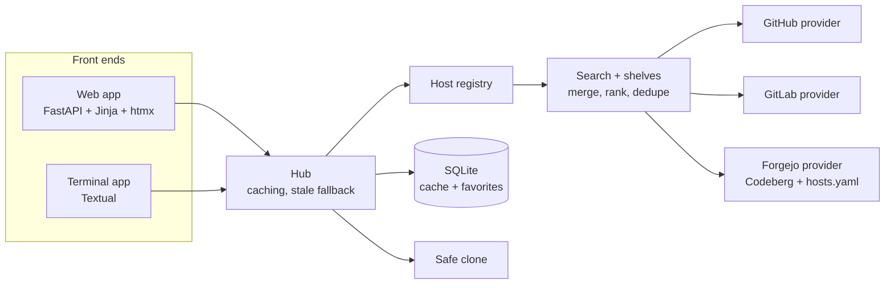

- **Hosts** are a registry: three built in, plus any extras from `hosts.yaml`. Search, shelves, favorites, the CLI and the clone allow-list all read it.
- **Providers** hide the differences between the APIs, so both front ends only ever see one `Repo` shape.
- **Search** queries all selected hosts concurrently, merges and ranks by stars, and reports per-host failures instead of failing the whole search.
- **Hub** adds a 10-minute search cache and a 1-hour detail cache in SQLite, and falls back to stale results when a host is unreachable or rate-limited.
- **Favorites and cache** live in a single SQLite file in your user data directory.

<details>
<summary><b>Project layout</b></summary>

```
src/repohub/
  core/
    models.py       Repo, Release, Asset, SearchFilters
    hosts.py        host registry (built-in hosts, HostSpec, HostRegistry)
    hostsconfig.py  loads and validates the personal hosts.yaml
    providers/      github.py, gitlab.py, forgejo.py, base.py (errors, slug + URL validation)
    search.py       fan-out, merge, rank, dedupe
    queryparse.py   search syntax (key:value tokens)
    browse.py       packaged and personal shelves (search and curated)
    hub.py          facade used by both front ends: caching, stale fallback
    cache.py        SQLite response cache with TTL
    store.py        favorites
    clone.py        safe git clone
    auth.py         token discovery per host
    textsafe.py     control-character stripping for untrusted text
  web/              FastAPI app, templates, static files (htmx is vendored)
  tui/              Textual app
  cli.py            the read-only repohub command
  config.py         wires providers, cache and favorites together
docs/plans/         design and implementation plan
tests/              offline test suite (+ opt-in live tests)
```

</details>

## 🔑 Tokens and configuration

Tokens are optional but raise API rate limits. Without one, GitHub search allows only about 10 requests a minute; RepoHub then shows a per-host banner and serves cached results where it can.

| What | How |
|---|---|
| GitHub token | `GITHUB_TOKEN`, then `GH_TOKEN`, then the output of `gh auth token` if the GitHub CLI is installed |
| GitLab token | `GITLAB_TOKEN` |
| Codeberg token | `CODEBERG_TOKEN` |
| Extra host token | the host's `token_env`, by default `REPOHUB_<ID>_TOKEN` (see [Hosts](#-hosts)) |
| Extra hosts | `~/.config/repohub/hosts.yaml` (see [Hosts](#-hosts)) |
| Clone folder | `REPOHUB_CLONE_DIR` (default `~/playground`) |
| Shelves | Packaged shelves ship with the app; add your own in `~/.config/repohub/shelves.yaml` (see [Shelves](#-shelves)) |
| Cache and favorites | One SQLite file, `repohub.db`, in your user data directory (`~/.local/share/repohub/` on Linux) |

Tokens are held in memory only, sent only to their own API host, and never logged. Surrounding whitespace is stripped. If a token is rejected (HTTP 401), RepoHub drops it for that host and retries once anonymously.

## 🛡️ Security

RepoHub renders untrusted data (descriptions, READMEs, release names) and runs `git clone`, so it is built defensively. Full details are in [SECURITY.md](SECURITY.md); report problems privately through GitHub's *Report a vulnerability*.

<details>
<summary><b>What protects what</b></summary>

**Web app**
- Binds to `127.0.0.1` by default and only accepts the `Host` headers `127.0.0.1` and `localhost`. A non-loopback `--host` prints a warning, and the Host allow-list still refuses other names.
- Favorite and clone requests need a per-session token, regenerated on every launch (a tab left open across a restart shows an error until reloaded).
- READMEs are rendered with markdown-it (raw HTML off, links validated) and then sanitised with nh3. A Content-Security-Policy limits scripts and other resources to the app itself.
- Links and homepages from API data are only shown when they are `http` or `https`.

**Terminal app**
- Renders all untrusted text as plain text (no markup interpretation) and opens links only when they are `http` or `https`.

**Hosts**
- `hosts.yaml` is treated as untrusted: strict URL validation, no IP literals, `REPOHUB_`-prefixed token variables only, size and count limits, duplicate keys rejected.
- A token is sent only to its own host, and redirects are not followed.

**Data**
- Control characters and bidirectional-override characters are stripped from provider data at the boundary; README text is capped at 200,000 characters.

**Clone**
- Only `https` URLs on a configured host (`github.com`, `gitlab.com`, `codeberg.org` and the hosts in your `hosts.yaml`); strict validation, then the URL is rebuilt in canonical form.
- Shallow (`--depth 1`); no install or build steps are run.
- Git runs with a locked-down environment: no prompts, https-only protocol, no system or global git config (`GIT_CONFIG_GLOBAL=/dev/null`, so proxy or credential-helper setups must be passed through environment variables).
- The destination must sit directly inside the chosen folder, an existing folder is never overwritten, concurrent clones of the same target are refused, and a failed clone cleans up only what it created.

</details>

## 🧪 Development

```bash
.venv/bin/pytest            # offline suite (live tests are deselected)
.venv/bin/pytest -m live    # opt-in smoke tests against the real GitHub, GitLab and Codeberg APIs
```

The offline suite uses mocked HTTP and fake providers, so it needs no network, no tokens and no real `git`. The live tests use a token found as described above, or run anonymously and may hit rate limits. CI runs the offline suite on Python 3.11 and 3.12.

The design and the task-by-task implementation plans are in [`docs/plans/`](docs/plans/).

## 🗺️ Roadmap

RepoHub grows in phases. Each phase gets a written design, a task-by-task plan, a fresh implementer for every task, and an independent review (with a security pass for anything that touches untrusted data, URLs, files or processes) before the next task starts. The current roadmap and its rationale are in [`docs/plans/2026-09-21-hosts-accounts-design.md`](docs/plans/2026-09-21-hosts-accounts-design.md) (which renumbers the earlier list in [`docs/plans/2026-09-21-phase1-design.md`](docs/plans/2026-09-21-phase1-design.md)).

| Phase | What it adds | Status |
|---|---|---|
| **v1** | Cross-host search, shelves, repo pages, favorites, safe clone, web app and terminal app | ✅ Done (13 tasks) |
| **1. Foundations** | Filters and sorting everywhere, curated shelves and the 171-project catalog, the scriptable CLI (v0.2.0) | ✅ Done (13 tasks) |
| **2. Other hosts** | A host registry and a Forgejo/Gitea provider: Codeberg built in, plus any Forgejo or Gitea instance you add in a config file (v0.3.0) | ✅ Done (10 tasks) |
| **3. Accounts and login** | Uses the sign-ins you already have (env variables, `gh` CLI) and stores nothing; an Accounts page shows who you are on each host, where the token came from, its scopes and rate limit | ✅ Done (v0.4.0, reviewed) |
| **4. Star and fork** | Star, unstar and fork from the web and terminal apps, always confirmed, with a local action log. The CLI stays read-only | ✅ Done (v0.5.0, reviewed; Codeberg not yet tried with a real token) |
| **5. Recommendations** | Suggestions from your favorites, your stars, an opt-in local history, and "similar to this repo", all computed on your machine | ✅ Done (v0.6.0, reviewed) |
| **6. Machine awareness** | "Already cloned" badges, a "Can I run this here?" panel (arm64 release assets, installed toolchains), and a shared project detector | ✅ Done (v0.7.0, reviewed) |
| **7. Guided install and run** | Shows the exact install and run commands for a cloned repo; you approve each command before it runs, and output streams live | 📝 Planned |
| **8. Favorites 2.0** | Tags, notes and collections for favorites, and a "new releases" tab | 📝 Planned |
| **9. Claude Code** | An MCP server (read-only by default), "Open in Claude Code" after cloning, and a `/repohub` skill built on the CLI | 📝 Planned |
| **10. UI redesign** | A better-looking web app and terminal app, done once the features above exist | 📝 Planned |

Standing rules for every phase: the existing clone protections stay as they are; running a repository's own code (Phase 7) is always a separate, explicit, opt-in action that shows exactly what it will run; and actions that change your accounts (Phase 4) are always confirmed and never run from the CLI.

<details>
<summary><b>Tasks: v1 (all done)</b></summary>

1. ✅ Project scaffold
2. ✅ Models and architecture parsing
3. ✅ Token discovery
4. ✅ SQLite cache with TTL
5. ✅ GitHub provider
6. ✅ GitLab provider
7. ✅ Cross-host search
8. ✅ Favorites store
9. ✅ Safe clone
10. ✅ Shelves and the Hub facade
11. ✅ Web app
12. ✅ Terminal app
13. ✅ README, live smoke tests and final verification

</details>

<details>
<summary><b>Tasks: Phase 1, Foundations (all done)</b></summary>

1. ✅ Model fields: `fork`, `sort`, `hide_forks`
2. ✅ Provider support for sorting and fork data
3. ✅ Merge, hide forks and final sort
4. ✅ Shared query-syntax parser
5. ✅ Web filters, sorting and query syntax
6. ✅ Terminal app query syntax
7. ✅ Shelf model, loader and personal shelves file
8. ✅ Hub support for curated shelves
9. ✅ Catalog shelves (171 projects)
10. ✅ Web curated shelves and shelf pages
11. ✅ Terminal curated shelves with paging
12. ✅ The `repohub` CLI
13. ✅ Docs, version bump and final verification

</details>

<details>
<summary><b>Tasks: Phase 2, Other hosts (all done)</b></summary>

1. ✅ Host registry
2. ✅ The `hosts.yaml` loader
3. ✅ Read the registry everywhere the host list was hard-coded
4. ✅ The Forgejo/Gitea provider
5. ✅ Build providers and tokens from the registry
6. ✅ Web app
7. ✅ Terminal app and CLI
8. ✅ A Codeberg shelf and unavailable hosts
9. ✅ Opt-in live tests for Codeberg
10. ✅ Docs, version and final verification

</details>

<details>
<summary><b>Sketch of the next phases</b> (each phase's real task list is written in its own plan)</summary>

- **Phase 2, other hosts (done):** a host registry replacing the hard-coded GitHub and GitLab pair; a Forgejo/Gitea provider (search, README, releases); Codeberg built in; extra instances in `~/.config/repohub/hosts.yaml` with strict URL validation; search, shelves, favorites, the CLI and the clone allow-list all reading the registry.
- **Phase 3, accounts and login (done):** token discovery per host; identity, scope and rate-limit lookups; an Accounts page in the web app, a key in the terminal app and a read-only `repohub accounts` command; nothing stored on disk.
- **Phase 4, star and fork (done):** star, unstar and fork for GitHub, GitLab and Forgejo; a confirmation naming the host, repository and account; no automatic retries; a local action log.
- **Phase 5, recommendations (done):** an interest profile from favorites, stars and an opt-in history; a "Recommended for you" shelf, "Similar repositories" on repo pages, and read-only `repohub recommend` and `repohub similar` commands; every suggestion explains why.
- **Phase 6, machine awareness (done):** a project detector (Cargo.toml, pyproject or requirements, package.json, Makefile, Dockerfile); a toolchain check; a "can I run this here?" panel; "already cloned" badges from a scan of your clone folder only.
- **Phase 7, guided install and run:** proposing commands from the detector; an approval step for every command; a runner confined to the cloned folder that streams output; strict review because it runs the repository's own code.
- **Phase 8, favorites 2.0:** storage for tags, notes and collections; editing and filtering in every interface; a "new releases" view.
- **Phase 9, Claude Code:** a read-only MCP server; an "Open in Claude Code" action after cloning; a `/repohub` skill on top of the CLI; cloning or installing through Claude Code stays a separate, individually approved action.
- **Phase 10, UI redesign:** a design pass over the web and terminal apps, with fresh screenshots.

</details>

## ⚠️ Known limitations

- Results from the three hosts (and any extra ones) are deduplicated by `owner/name`, so different repositories that share an owner and name across hosts are merged.
- Forgejo servers vary by version; Codeberg was checked. Forgejo search matches one keyword on the server and cannot filter by language, stars or recency there, so RepoHub filters client-side and a page can shrink. The license is unknown.
- GitLab search results carry no language unless you filter by language, and its minimum-stars filter is applied client-side, so a page of results can shrink.
- Recency filters drop repositories with an unknown push date.
- Curated shelf refreshes use extra API requests (a bounded number per page, cached for one hour). Without a token GitHub allows only about 60 core requests per hour, so keep a token set for heavy browsing.
- GitHub's own "updated" ordering differs slightly from the last-push date RepoHub re-sorts by, so `sort:updated` can reorder the fetched page.
- A rate-limited host stops curated refreshes for a while (at least 60 seconds) and shows the snapshot instead.
- Personal search shelves are validated: `language` and `topic` must use the same characters the search syntax allows (`topic` is lowercased), `query` is at most 200 characters on one line, and a `repos` key that is empty is an error.
- GitLab cannot sort by forks or hide forks server-side, so those options only apply to the results that were fetched.
- Remote images in READMEs can load in the web app (the CSP allows `img-src *`), which shows your IP address to those hosts.
- The cache is never purged; expired entries are only overwritten.
- Bitbucket is not planned. See the [roadmap](#-roadmap) for what is planned.

## 📜 License

[MIT](LICENSE) © 2026 DaRipper91
