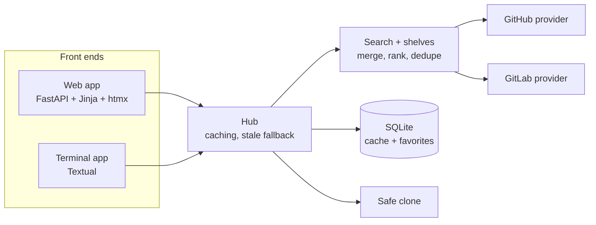

<p align="center">
  
</p>

<p align="center">
  <a href="https://github.com/DaRipper91/repohub/actions/workflows/ci.yml"></a>
  
  
  
  
  
</p>

<p align="center">
  <b>Search GitHub and GitLab in one box. Open a store-style page for any repo. Favorite it. Clone it safely.</b><br>
  <sub>A local web app and a terminal app, sharing one core.</sub>
</p>

<p align="center">
  <a href="#-features">Features</a> ·
  <a href="#-quick-start">Quick start</a> ·
  <a href="#-terminal-app">Terminal app</a> ·
  <a href="#-web-app">Web app</a> ·
  <a href="#-how-it-works">How it works</a> ·
  <a href="#-security">Security</a> ·
  <a href="#-development">Development</a>
</p>

<p align="center">
  
  <br>
  <sub>The web app's home page: browse shelves, or search both hosts at once. (Screenshot taken 2026-09-20 with live data.)</sub>
</p>

---

## ✨ Features

| | |
|---|---|
| 🔎 **One search, two hosts** | GitHub and GitLab are queried together and merged into a single ranked list. Filter by language, minimum stars, recent activity and host. If one host fails or rate-limits you, the other host's results still show. |
| 🗂️ **Store-style shelves** | Browse curated shelves (Terminal tools, Local AI, Retro and emulation, Self-hosted, Creative coding, Networking) without typing a query. Shelves are plain YAML you can edit. |
| 📄 **Repo pages that read like an app page** | Rendered README, stars, forks, license, topics, and the latest release with its files. A green **arm64** badge appears when a release ships an arm64 or aarch64 build. |
| ⭐ **Favorites** | Save repos to a local wishlist. Stats refresh in the background and never block the page. |
| 📥 **Safe clone** | Shows the exact destination and asks before doing anything. Shallow clone, `https` on `github.com` or `gitlab.com` only, and no install or build steps are ever run. |
| 🖥️ **Two front ends, one core** | A local web app (FastAPI, Jinja, htmx) and a keyboard-driven terminal app (Textual). Both use the same providers, search, cache and favorites. |
| 🔒 **Local-first** | Runs on your machine, binds to loopback by default, keeps tokens in memory, and has no analytics or telemetry. |

## 🚀 Quick start

Requires **Python 3.11 or newer** (developed on 3.12).

```bash
git clone https://github.com/DaRipper91/repohub.git
cd repohub
uv venv --python 3.12 .venv
uv pip install --python .venv/bin/python -e ".[dev]"
```

Prefer plain pip? `python -m venv .venv && .venv/bin/python -m pip install -e ".[dev]"` works too.

Then start whichever front end you like:

```bash
.venv/bin/repohub-web    # http://127.0.0.1:8765   (options: --host, --port)
.venv/bin/repohub-tui    # terminal app            (options: --help, --version)
```

Add a token for higher API rate limits (optional, see [Tokens](#-tokens-and-configuration)):

```bash
export GITHUB_TOKEN=...   # or just be logged in with the GitHub CLI: gh auth login
export GITLAB_TOKEN=...
```

## 🖥️ Terminal app

Keyboard-first, with everything the web app does. Type a query and press Enter, or open a shelf.

<p align="center">
  
</p>

Open a repository to read its README and release info. Press `f` to favorite it or `c` to clone it.

<p align="center">
  
</p>

| Key | Action |
|---|---|
| `Enter` | Open the selected shelf or repository |
| `f` | Favorite or unfavorite (repository screen) |
| `c` then `y` / `n` | Clone: shows the destination, then confirm or cancel |
| `Ctrl+F` | Show your favorites |
| `Esc` | Back from a repository, or return to the shelves |
| `Ctrl+Q` | Quit |

## 🌐 Web app

Search across both hosts with filters, then open any repo for a store-style page.

<p align="center">
  
</p>

<p align="center">
  
</p>

The web app starts on <http://127.0.0.1:8765>. It only accepts requests addressed to `127.0.0.1` or `localhost`; see [Security](#-security).

## 🧠 How it works



- **Providers** hide the differences between the two APIs, so both front ends only ever see one `Repo` shape.
- **Search** queries both hosts concurrently, merges and ranks by stars, and reports per-host failures instead of failing the whole search.
- **Hub** adds a 10-minute search cache and a 1-hour detail cache in SQLite, and falls back to stale results when a host is unreachable or rate-limited.
- **Favorites and cache** live in a single SQLite file in your user data directory.

<details>
<summary><b>Project layout</b></summary>

```
src/repohub/
  core/
    models.py       Repo, Release, Asset, SearchFilters
    providers/      github.py, gitlab.py, base.py (errors, slug + URL validation)
    search.py       fan-out, merge, rank, dedupe
    browse.py       shelves loaded from shelves.yaml
    hub.py          facade used by both front ends: caching, stale fallback
    cache.py        SQLite response cache with TTL
    store.py        favorites
    clone.py        safe git clone
    auth.py         token discovery
    textsafe.py     control-character stripping for untrusted text
  web/              FastAPI app, templates, static files (htmx is vendored)
  tui/              Textual app
  config.py         wires providers, cache and favorites together
docs/plans/         design and implementation plan
tests/              offline test suite (+ opt-in live tests)
```

</details>

## 🔑 Tokens and configuration

Tokens are optional but raise API rate limits. Without one, GitHub search allows only about 10 requests a minute; RepoHub then shows a per-host banner and serves cached results where it can.

| What | How |
|---|---|
| GitHub token | `GITHUB_TOKEN`, then `GH_TOKEN`, then the output of `gh auth token` if the GitHub CLI is installed |
| GitLab token | `GITLAB_TOKEN` |
| Clone folder | `REPOHUB_CLONE_DIR` (default `~/playground`) |
| Shelves | Edit `src/repohub/core/shelves.yaml`: each shelf has a `name`, optional `topic`, `min_stars` and `days` (recent-push window) |
| Cache and favorites | One SQLite file, `repohub.db`, in your user data directory (`~/.local/share/repohub/` on Linux) |

Tokens are held in memory only, sent only to their own API host, and never logged. Surrounding whitespace is stripped. If a token is rejected (HTTP 401), RepoHub drops it for that host and retries once anonymously.

Shelf edits take effect with an editable install (`-e`, as above); otherwise edit the installed copy.

## 🛡️ Security

RepoHub renders untrusted data (descriptions, READMEs, release names) and runs `git clone`, so it is built defensively. Full details are in [SECURITY.md](SECURITY.md); report problems privately through GitHub's *Report a vulnerability*.

<details>
<summary><b>What protects what</b></summary>

**Web app**
- Binds to `127.0.0.1` by default and only accepts the `Host` headers `127.0.0.1` and `localhost`. A non-loopback `--host` prints a warning, and the Host allow-list still refuses other names.
- Favorite and clone requests need a per-session token, regenerated on every launch (a tab left open across a restart shows an error until reloaded).
- READMEs are rendered with markdown-it (raw HTML off, links validated) and then sanitised with nh3. A Content-Security-Policy limits scripts and other resources to the app itself.
- Links and homepages from API data are only shown when they are `http` or `https`.

**Terminal app**
- Renders all untrusted text as plain text (no markup interpretation) and opens links only when they are `http` or `https`.

**Data**
- Control characters and bidirectional-override characters are stripped from provider data at the boundary; README text is capped at 200,000 characters.

**Clone**
- Only `https` URLs on `github.com` or `gitlab.com`; strict validation, then the URL is rebuilt in canonical form.
- Shallow (`--depth 1`); no install or build steps are run.
- Git runs with a locked-down environment: no prompts, https-only protocol, no system or global git config (`GIT_CONFIG_GLOBAL=/dev/null`, so proxy or credential-helper setups must be passed through environment variables).
- The destination must sit directly inside the chosen folder, an existing folder is never overwritten, concurrent clones of the same target are refused, and a failed clone cleans up only what it created.

</details>

## 🧪 Development

```bash
.venv/bin/pytest            # offline suite (live tests are deselected)
.venv/bin/pytest -m live    # opt-in smoke tests against the real GitHub and GitLab APIs
```

The offline suite uses mocked HTTP and fake providers, so it needs no network, no tokens and no real `git`. The live tests use a token found as described above, or run anonymously and may hit rate limits. CI runs the offline suite on Python 3.11 and 3.12.

The design and the task-by-task implementation plan are in [`docs/plans/`](docs/plans/).

## ⚠️ Known limitations

- Results from the two hosts are deduplicated by `owner/name`, so different repositories that share an owner and name across hosts are merged.
- GitLab search results carry no language unless you filter by language, and its minimum-stars filter is applied client-side, so a page of results can shrink.
- Recency filters drop repositories with an unknown push date.
- Remote images in READMEs can load in the web app (the CSP allows `img-src *`), which shows your IP address to those hosts.
- The cache is never purged; expired entries are only overwritten.
- Not included in v1: accounts or login flows, starring or forking from inside the app, other hosts (Codeberg, Bitbucket), and recommendations.

## 📜 License

[MIT](LICENSE) © 2026 DaRipper91
